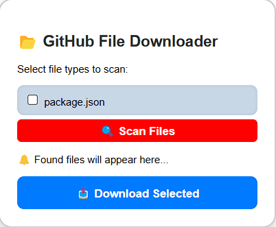

# 📂 GitHub File Downloader Chrome Extension

A **Chrome extension** that scans **GitHub search results** and downloads **all `package.json` files** from the listed repositories **instantly**.

## 🚀 Features
✅ **Search & Download:** Enter a query in the GitHub search bar, and the extension will scan all repositories in the search results.  
✅ **Batch Download:** Automatically downloads **all** `package.json` files from multiple repositories.  
✅ **No "Save As" Popup:** Files are saved directly as `package1.json`, `package2.json`, `package3.json`, etc.  
✅ **Fast & Efficient:** Saves time by avoiding manual downloads.  

---

## 🛠 Installation Guide
1. **Download the extension**:
   - Click the green **Code** button on GitHub and select **Download ZIP**.
   - Extract the ZIP file on your computer.
   
2. **Load the extension into Chrome**:
   - Open **Google Chrome** and go to:
     ```
     chrome://extensions/
     ```
   - Enable **Developer Mode** (toggle switch at the top right).
   - Click **Load unpacked** and select the **extracted project folder**.

3. The extension is now installed! 🎉  
   - You should see a 📂 **GitHub File Downloader** icon in your Chrome toolbar.

---

## 📌 How to Use
### Step 1: Search on GitHub
- Go to [GitHub](https://github.com) and use the **search bar** at the top.
- Search for **`package.json`** using a relevant query.  
  Example search query:  
   ```sh
  org:microsoft path:**/package.json

## 🎥 Demo

### 📌 Image Preview  
<p align="center">
  
</p>

### 🔥 Live Demo (GIF)  


## 📌 Use Cases  

🔍 **Security Research** – This tool helps security researchers identify **dependency confusion vulnerabilities** by automating the download of `package.json` files from multiple repositories.  

⚡ **Automated Analysis** – Researchers can analyze dependencies in the downloaded files to check for **unclaimed package names** on npm and attempt **package hijacking** attacks in a controlled environment.  

🛠 **Bug Bounty & Pentesting** – Pentesters and bug bounty hunters can quickly collect dependency information to **assess supply chain risks** in open-source projects.  

## 📜 Future Updates (Roadmap)
- Support for additional file types: Enable downloading of gemfile and requirements.txt files.
- UI Improvements: Enhance the user interface for a smoother experience.
- Download Progress Status: Add a progress bar or notification to track file downloads.

## 🚀 Contributing to GitHub File Downloader

We welcome contributions to improve **GitHub File Downloader**! 🎉  
Follow these steps to contribute effectively.
---
## 🛠 How to Contribute
### 1️⃣ Fork the Repository
- Click the **Fork** button on the top right of this repository.
- This will create a copy of the repo under your GitHub account.

### 2️⃣ Clone Your Fork
```sh
git clone https://github.com/zeusgodyt/GitHub-File-Downloader-Chrome-Extension.git

